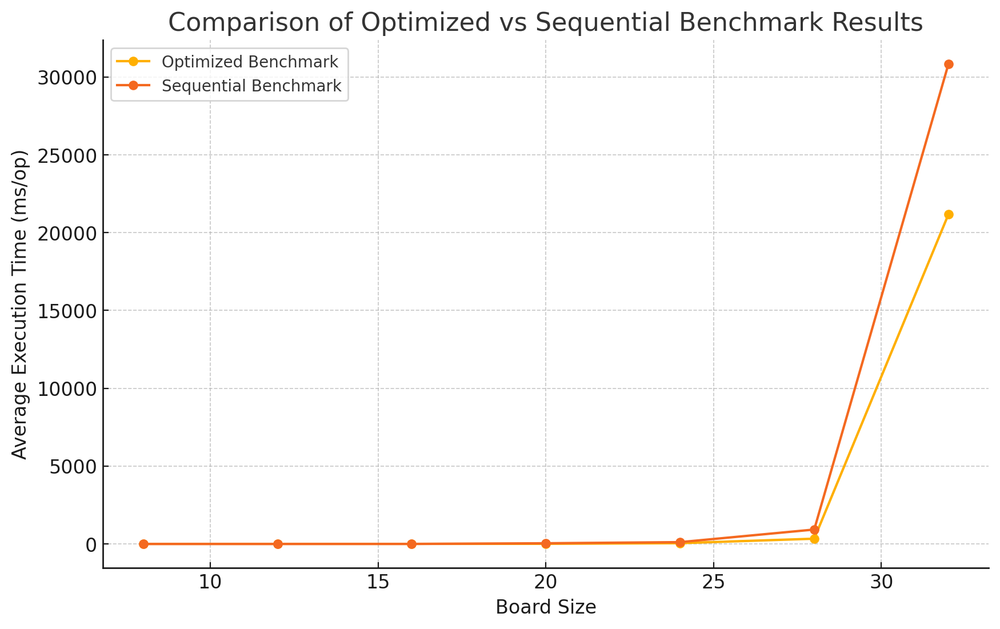

# Projeto NQueens

## Descrição do Projeto

Este repositório contém o código-fonte do projeto desenvolvido para a disciplina ES45A, onde o grupo implementou duas soluções para o problema das N-Rainhas: uma versão sequencial e outra utilizando threads para otimização de desempenho.

### Implementações

- **Sequencial:** `NQueensSequencial.java`
- **Otimizada com Threads:** `NQueensOptimized.java`

### Estrutura dos Resultados de Teste

Os testes de desempenho foram realizados utilizando um benchmark, e os resultados podem ser encontrados na seguinte estrutura de diretórios:

```
  test-results
  ├── optimized_benchmark_results.csv   # Resultados do benchmark para a implementação otimizada
  ├── sequential_benchmark_results.csv  # Resultados do benchmark para a implementação sequencial
  └── result.png                        # Imagem ilustrativa dos resultados

  nqueens/demo/src/main/java/nqueens
  ├── NQueensOptimizedBenchmark.java    # Teste para a implementação otimizada
  └── NQueensSequentialBenchmark.java   # Teste para a implementação sequencial
```

### 1. Visão Geral do Problema das N-Rainhas

O problema das N-Rainhas é um desafio clássico de colocação que exige posicionar N rainhas em um tabuleiro de xadrez de N x N de modo que nenhuma rainha possa atacar outra. Isso significa que nenhuma rainha pode compartilhar a mesma linha, coluna ou diagonal com outra rainha.

### 2. Descrição das Implementações

#### NQueensOptimized.java

- **Descrição:** Esta versão utiliza técnicas avançadas de paralelismo e otimizações para melhorar o desempenho na resolução do problema.
- **Bibliotecas Utilizadas:** `java.util.BitSet`, `java.util.concurrent.ExecutorService`, `java.util.concurrent.atomic.AtomicBoolean`.
- **Características:** Implementação que permite a exploração simultânea de diferentes partes do espaço de busca, interrompendo as operações quando uma solução é encontrada.

#### NQueensSequential.java

- **Descrição:** Abordagem tradicional e direta usando backtracking para resolver o problema.
- **Características:** Realiza verificações sequenciais para garantir a segurança antes de colocar cada rainha, ideal para entendimento básico do problema.

### 3. Análise Comparativa

- **Complexidade e Eficiência:**
  - A implementação otimizada se beneficia de técnicas de paralelismo, sendo mais eficiente em sistemas multicore.
  - A versão sequencial, apesar de mais simples, é menos eficiente para grandes valores de N devido à sua natureza não paralela.

- **Escalabilidade:**
  - A implementação otimizada é mais escalável e adequada para problemas de maior dimensão.
  - A versão sequencial é mais limitada e se torna menos viável à medida que o tamanho do tabuleiro aumenta.

- **Facilidade de Implementação e Manutenção:**
  - A versão sequencial é mais simples e mais fácil de manter, ideal para quem está aprendendo sobre o problema.
  - A versão otimizada, embora mais complexa, oferece melhor desempenho e é preferível em aplicações que exigem alta eficiência.

### 4. Resultados dos Testes

Os testes foram conduzidos em um ambiente Ubuntu 20.04 com 16GB de RAM e um processador AMD Ryzen 5 1600, usando o Java Microbenchmark Harness (JMH) para medir o desempenho.

#### Resultados dos Benchmarks

##### Implementação Sequencial

Os tempos de execução aumentaram rapidamente com o tamanho do tabuleiro:

- Tamanho 8: ~0.05 ms/op
- Tamanho 12: ~0.08 ms/op
- Tamanho 16: ~2.48 ms/op
- Tamanho 20: ~45.52 ms/op
- Tamanho 24: ~118.17 ms/op
- Tamanho 28: ~927.34 ms/op
- Tamanho 32: ~30830.67 ms/op

##### Implementação Otimizada

A versão otimizada apresentou melhor desempenho, especialmente para tamanhos maiores:

- Tamanho 8: ~4.13 ms/op
- Tamanho 12: ~4.95 ms/op
- Tamanho 16: ~4.92 ms/op
- Tamanho 20: ~11.65 ms/op
- Tamanho 24: ~51.55 ms/op
- Tamanho 28: ~338.74 ms/op
- Tamanho 32: ~21175.84 ms/op

#### Análise dos Resultados



O gráfico acima mostra que a implementação otimizada tem um crescimento mais controlado nos tempos de execução em comparação com a versão sequencial. Para valores menores de N, as diferenças não são tão significativas, mas tornam-se mais pronunciadas à medida que o tamanho do tabuleiro aumenta.

### 5. Conclusão

- **Eficiência:** A implementação otimizada é significativamente mais eficiente para tamanhos maiores de tabuleiro.
- **Aplicabilidade:** A versão sequencial é adequada para propósitos educacionais e para pequenos valores de N, enquanto a versão otimizada é preferível para cenários de produção onde o desempenho é crucial.
- **Escalabilidade:** A versão otimizada demonstra ser mais escalável, aproveitando a arquitetura de sistemas multicore para lidar com cargas de trabalho maiores de forma eficiente.

Essas conclusões são suportadas pelos resultados dos benchmarks realizados, conforme visualizado no gráfico de desempenho fornecido.
